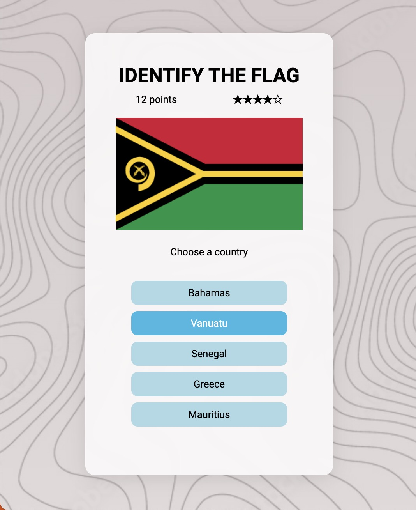
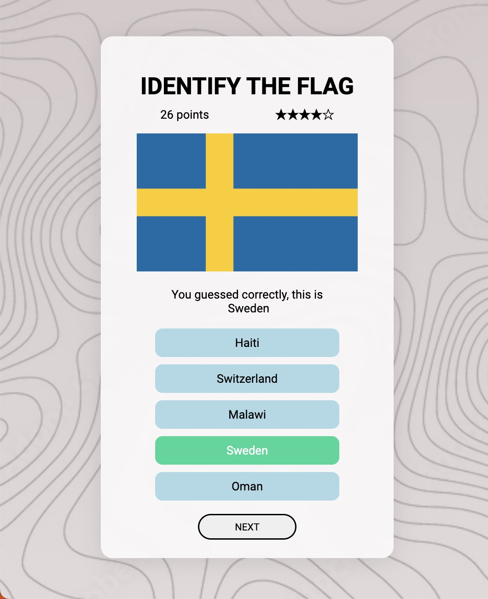
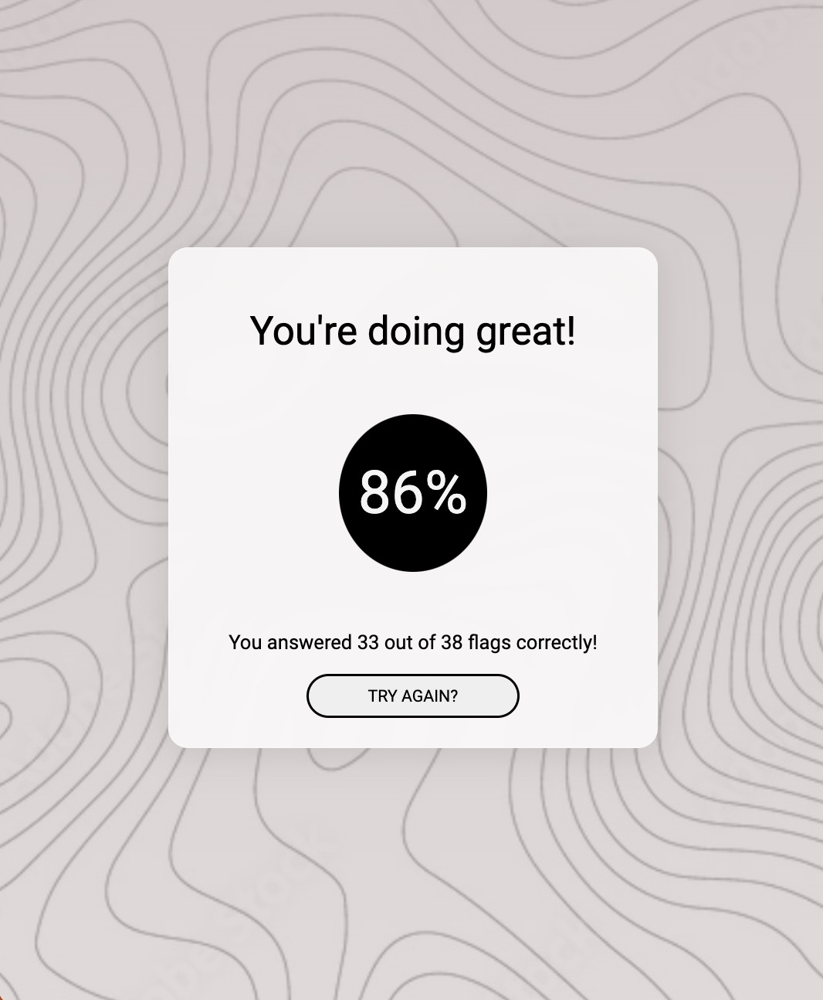

# Flag Game

I had so much fun designing this project and I learned so much while I worked on it. It went through many iterations as I wanted to try out so many different tools and it ultimately slowed down my process. In the end, I focused on the functionality and am really happy with the results.  Although I am content at the moment, there are many things I would like to change and many features I would like to add on.

In this app, the player is shown a flag from one of the world's countries.  They are given five options to choose from and have one opportunity to win the point.  If they guess correctly, they will receive a point.  If they guess incorrectly, one life will be deducted and they will be shown the correct answer.  When they lose all of their lives, the game ends and they are given their final score.

 
 

## My process

### Built with

- React.js
- CSS modules
- fetch API
- Vite

### What I learned

This was a real learning experience as it was something I did on my own. Something that I learned was how important it is to know how the object you're fetching is structured. The name of the country was buried deeper than I expected (i.e country.name.common) and I kept running into issues because of this.

I also learned the importance of state management and when state is actually updated and available to use. I had many errors with starting my app because the async function had yet to retrieve the API before attempting to load. I originally wanted to make the app auto refresh so the user could go as fast as they could, but this proved to be quite difficult.

### Continued development

I had so many ideas of extra features I could add to this app while I developed it. The free API I used included a lot of information and I only used the flag and country name. I would love to develop another app that, after guessing the country correctly, you'd have to guess other important information such as capital or currency. I also thought that I could develop the game to be continent specific - so a user could choose which continent's flags they would like to work on.

The other feature I'd like to add, which would be my first attempt, would be to record their score in local storage.  I'd love for the user to have an opportunity to see their previous high score and try to beat it!
